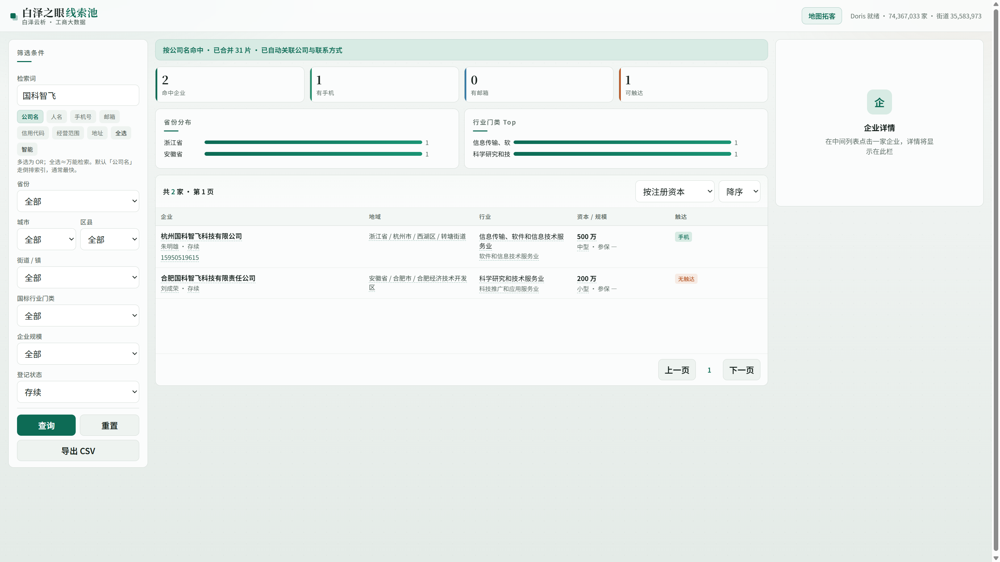
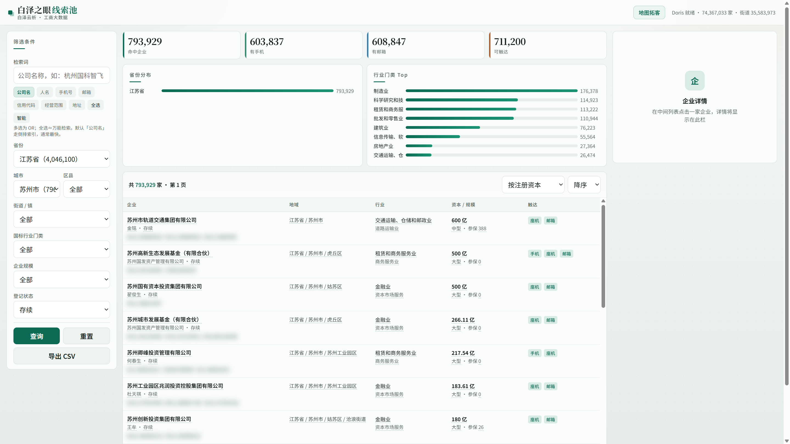
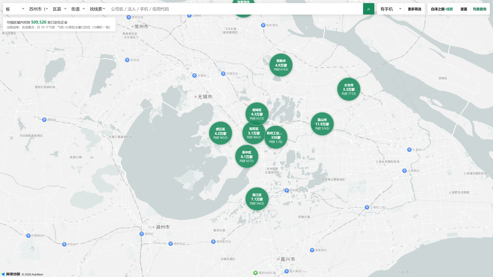

# Baize Eye Leads · 白泽之眼

<p align="center">
  <strong>白泽云析</strong> · 工商大数据线索池<br/>
  多维检索 · 四级区划 · 地图拓客
</p>

<p align="center">
  <a href="https://github.com/ai-guoke/baize-eye-leads"></a>
  
  
</p>

把全国工商主体与触达信息沉到一套可检索、可圈选、可地图作业的线索池里——适合数据分析练习、课程作业、科研原型与区域研究。

> 本仓库为**开源软件与文档**，不包含工商原始库。演示截图来自本地 Doris 环境，联系方式等敏感字段已做展示处理。

---

## 界面预览

### 关键词检索 + 命中分布

公司名等多维检索，统计卡片与省 / 行业分布同步更新，右侧常驻企业详情。



### 区域圈选（苏州示例）

省市区街筛选后，对百万级存续主体做触达概览与排序列表。



### 地图拓客

高德底图 + 区县聚合气泡：家数、均值资本一目了然，点击下钻到街道 / 单企。



---

## 能做什么

| 模块 | 说明 |
|------|------|
| **检索** | 公司名 / 法人 / 手机 / 邮箱 / 信用代码 / 经营范围 / 地址，支持多维 OR |
| **筛选** | 省市区街、行业、规模、登记状态、触达方式 |
| **列表** | 命中统计、省份 / 行业分布、详情栏、CSV 导出 |
| **地图** | 视野聚合、区域侧栏、地点搜索、与列表筛选互通 |
| **扫描动效** | 全国关键词检索可按省真实分片，日志展示各省命中与耗时 |

---

## 技术栈

| 层 | 选型 |
|----|------|
| 分析库 | [Apache Doris](https://doris.apache.org/) |
| API | FastAPI + Uvicorn |
| 前端 | 原生 HTML / JS（列表 + 地图） |
| 地图 | 高德 JS API 2.0 |

---

## 快速开始

### 环境要求

- Python 3.10+
- Docker（启动 Doris，见 `docker/`）
- 高德开放平台 Key（地图功能）

### 安装与密钥

```powershell
git clone https://github.com/ai-guoke/baize-eye-leads.git
cd baize-eye-leads

python -m venv .venv
.\.venv\Scripts\activate
pip install -r requirements.txt

copy secrets\amap.env.example secrets\amap.env
# 编辑 secrets\amap.env，填入 AMAP_JS_KEY / AMAP_SECURITY_CODE / AMAP_WEB_KEY
```

### 启动 Doris 与 API

在仓库根目录执行（保证 `import app` 可用）：

```powershell
cd docker
docker compose up -d
cd ..

# 按 sql/、etl/ 导入自有工商数据后：
python -m uvicorn app.main:app --host 0.0.0.0 --port 8765
```

也可双击 `scripts\一键构建并启动.bat`（会切到仓库根再启动 API）。

| 页面 | 地址 |
|------|------|
| 列表检索 | http://127.0.0.1:8765 |
| 地图拓客 | http://127.0.0.1:8765/map |

更多运维说明见 [docs/ops-doris.md](docs/ops-doris.md)。数据清洗约定见 [docs/数据清洗规则.md](docs/数据清洗规则.md)。

---

## 目录结构

```
app/                 # FastAPI 应用（main.py + Doris 客户端 + 页面模板/静态资源）
etl/                 # 数据导入、街道回填、地理编码
sql/                 # Doris 建表脚本
docker/              # Doris Compose
docs/                # 文档与截图
scripts/             # 运维脚本、xlsx 工具
scripts/legacy/      # 旧版 SQLite 看板（已弃用，仅归档）
secrets/             # 本地密钥（仅 *.example 入库）
requirements.txt
```

---

## 数据说明与交流

本仓库只开源**代码与文档**，不直接附带全量工商数据库。

若你在做**科研、课程学习或作业练习**，需要样例库 / 导入指引 / 环境联调，欢迎扫码加微信（备注：`白泽之眼` + 用途，例如「课程作业 / 毕设 / 科研」）：

<p align="center">
  
</p>

**使用边界（请务必阅读）**

- 相关数据与材料**仅供科研、学习、教学与作业练习**使用。
- **禁止用于任何商业获客、营销外呼、售卖转售或其它营利用途。**
- 请自行遵守所在地关于个人信息保护与数据安全的法律法规；因违规使用产生的后果由使用者自行承担。
- 仓库内的 MIT 许可适用于**软件代码**；数据本身不随仓库分发，亦不构成任何商业授权。

`secrets/amap.env`、`output/` 等本地产物已在 `.gitignore` 中排除，请勿把密钥与原始库推送到公开仓库。

---

## 许可

[MIT](LICENSE) © 白泽云析 / ai-guoke

欢迎 Issue / PR。若本项目对你有帮助，欢迎 Star。
